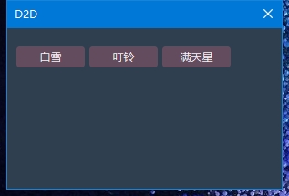
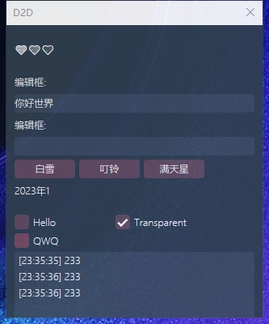
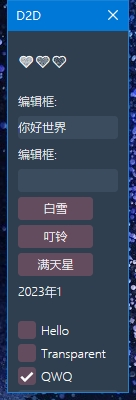

# 简单的D2D Graphical User Interface 设计


## 只需要一个头文件ui.h

简单的使用：

```
void Render()
{
	ui::Begin();
ui::Button(L"白雪");
	ui::SameLine();
	if (ui::Button(L"叮铃"))ui::AsyncBeep();
	ui::SameLine();
	if (ui::Button(L"满天星"))
	{
		LOG(L"满天星");
	}
	ui::End();
}
```






简单的自动布局


